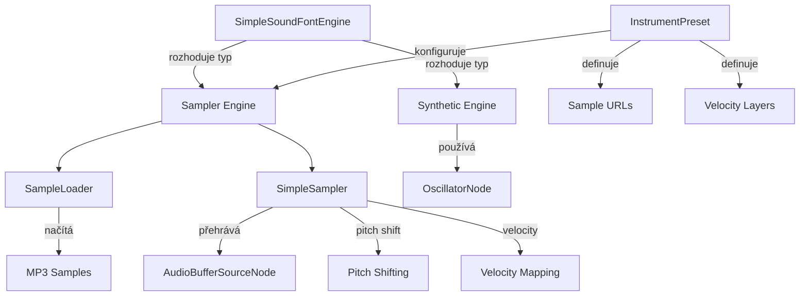

# Implementace hybridního zvukového enginu se samplery

## Cíl

Implementovat hybridní zvukový engine, který kombinuje:

- **Audio samplery** (MP3) pro solidní akustický zvuk piana
- **Syntetické nástroje** (oscillators) jako alternativu/fallback
- Podporu pro další nástroje v budoucnu

## Architektura



## Implementační kroky

### 1. SampleLoader - načítání a cachování samplů

**Soubor:** `src/services/audio/SampleLoader.ts`

- Singleton třída pro načítání audio samplů
- Cachování `AudioBuffer` v `Map<string, AudioBuffer>`
- Metody:
  - `loadSample(url: string): Promise<AudioBuffer>` - načte a dekóduje MP3
  - `loadPresetSamples(preset: InstrumentPreset): Promise<Map<string, AudioBuffer>>` - načte všechny samply presetu
  - `getSample(key: string): AudioBuffer | null` - vrátí cachovaný sample
  - `clearCache()` - vyčistí cache

### 2. SimpleSampler - sampler engine

**Soubor:** `src/services/audio/SimpleSampler.ts`

- Třída pro přehrávání samplů s podporou:
  - Velocity mapování (3 vrstvy: soft 0-85, medium 86-127, hard 86-127)
  - Pitch shifting pro noty bez samplů (použití `playbackRate` na `AudioBufferSourceNode`)
  - Sustain pedál logika
  - Polyfonie (tracking aktivních not)
- Metody:
  - `loadPreset(preset: InstrumentPreset): Promise<void>` - načte samply presetu
  - `noteOn(midi: number, velocity: number): void` - přehraje notu
  - `noteOff(midi: number): void` - zastaví notu
  - `setSustain(sustain: boolean): void` - sustain pedál
  - `dispose(): void` - cleanup

### 3. InstrumentPreset - konfigurace nástrojů

**Soubor:** `src/config/instrumentPresets.ts`

- Definice typů a konfigurací pro nástroje
- Typy:
  ```typescript
  type VelocityLayer = 'soft' | 'medium' | 'hard';
  type InstrumentType = 'sampler' | 'synthetic';
  
  interface SampleConfig {
    midi: number; // MIDI nota, pro kterou existuje sample
    layers: {
      soft: string;   // URL k MP3 samplu
      medium: string;
      hard: string;
    };
  }
  
  interface InstrumentPreset {
    id: string;
    name: string;
    type: InstrumentType;
    samples?: SampleConfig[]; // Pro sampler typ
    syntheticType?: 'piano' | 'dx7'; // Pro synthetic typ
  }
  ```

- Preset pro piano:
  - Samply pro každou 3. notu (C, D#, F#, A) v oktávách C2-C7
  - 3 velocity vrstvy pro každý sample
  - Pitch shifting pro mezilehlé noty

### 4. Rozšíření SimpleSoundFontEngine

**Soubor:** `src/services/audio/SoundFontEngine.ts`

- Přidat podporu pro sampler-based nástroje
- Změny:
  - Přidat `private sampler: SimpleSampler | null = null`
  - V `loadSoundFont()`: rozpoznat sampler presety (`preset:piano-acoustic`)
  - V `noteOn()`: pokud je sampler načten, použít `sampler.noteOn()`, jinak syntetický engine
  - V `noteOff()`: podobně delegovat na sampler
  - V `setSustain()`: delegovat na sampler

### 5. Aktualizace typů

**Soubor:** `src/services/audio/types.ts`

- Přidat typy pro sampler:
  ```typescript
  export interface InstrumentPreset {
    id: string;
    name: string;
    type: 'sampler' | 'synthetic';
    // ...
  }
  ```


### 6. Aktualizace useAudioStore

**Soubor:** `src/stores/useAudioStore.ts`

- Rozšířit `SoundFontInfo` o `type?: 'sampler' | 'synthetic'`
- Nebo vytvořit nový typ `InstrumentInfo` pro lepší typovou bezpečnost

### 7. Aktualizace InstrumentSelector

**Soubor:** `src/components/InstrumentSelector/InstrumentSelector.tsx`

- Přidat piano sampler do seznamu nástrojů:
  ```typescript
  {
    id: 'piano-acoustic',
    name: 'Piano (Acoustic)',
    url: 'preset:piano-acoustic',
    type: 'sampler'
  }
  ```

- Zachovat současné syntetické nástroje:
  - `piano` (synthetic)
  - `dx7` (synthetic)

### 8. Struktura samplů

**Adresář:** `public/samples/piano-acoustic/`

Struktura souborů:

```
samples/
  piano-acoustic/
    C2-soft.mp3
    C2-medium.mp3
    C2-hard.mp3
    D#2-soft.mp3
    D#2-medium.mp3
    D#2-hard.mp3
    F#2-soft.mp3
    ...
    C7-soft.mp3
    C7-medium.mp3
    C7-hard.mp3
```

Naming convention: `{Note}{Octave}-{Layer}.mp3`

- Note: C, C#, D, D#, E, F, F#, G, G#, A, A#, B
- Octave: 2-7
- Layer: soft, medium, hard

### 9. Pitch shifting logika

**V SimpleSampler:**

- Najít nejbližší sample pro danou MIDI notu
- Vypočítat pitch ratio: `playbackRate = 2^((targetMidi - sampleMidi) / 12)`
- Aplikovat na `AudioBufferSourceNode.playbackRate`
- Omezit rozsah: max ±2 oktávy od původního samplu (kvalita)

### 10. Velocity mapování

**V SimpleSampler:**

```typescript
function getVelocityLayer(velocity: number): VelocityLayer {
  if (velocity <= 85) return 'soft';
  if (velocity <= 127) return 'medium'; // nebo 'hard' podle konfigurace
  return 'hard';
}
```

## Důležité soubory k úpravě

1. **Nové soubory:**

   - `src/services/audio/SampleLoader.ts`
   - `src/services/audio/SimpleSampler.ts`
   - `src/config/instrumentPresets.ts`

2. **Upravené soubory:**

   - `src/services/audio/SoundFontEngine.ts` - přidat sampler support
   - `src/services/audio/types.ts` - přidat typy pro presety
   - `src/stores/useAudioStore.ts` - rozšířit o sampler nástroje
   - `src/components/InstrumentSelector/InstrumentSelector.tsx` - přidat piano-acoustic
   - `src/components/AudioInitButton/AudioInitButton.tsx` - podpora pro sampler loading

## Testování

1. Načtení samplů - ověřit, že se samply správně načtou a cachují
2. Velocity vrstvy - ověřit správné mapování velocity → layer
3. Pitch shifting - ověřit správný pitch pro noty bez samplů
4. Sustain pedál - ověřit správné chování se samplery
5. Přepínání nástrojů - ověřit přepínání mezi sampler a synthetic

## Poznámky

- Samply budou lazy-loaded při výběru nástroje
- Cache samplů zůstane v paměti pro rychlý přístup
- Pro noty mimo rozsah samplů použijeme pitch shifting (max ±2 oktávy)
- Syntetické nástroje zůstanou jako fallback/alternativa